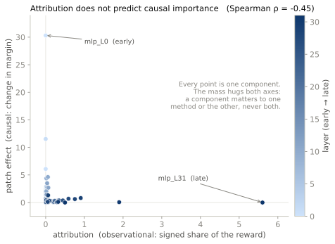

# Interpreting results honestly

Mechanistic interpretability has an overclaiming problem. A clean figure gets read as a mechanism, an observational correlation gets written up as a cause, and a result on one example gets stated as a general law. Reward models make all three temptations worse, because the scalar target produces unusually crisp pictures, and a crisp picture is easy to trust. This section is the counterweight. It is not an appendix of disclaimers. It is the part of the docs that tells you which of your conclusions you have actually earned.

## Attribution is not causation, and here is the proof

The headline limitation is the one the library discovered about itself. Component attribution, which reads how much of the reward each component carries, does not predict which components causally matter.

{ .rl-fig }

/// caption
Every component of a helpfulness pair, attribution on the horizontal axis, causal patch effect on the vertical. If attribution predicted causation the cloud would run along the diagonal. It runs along the axes instead. The late MLP that attribution credits most has almost no causal effect; the early MLP that patching finds most necessary is credited almost nothing.
///

Ranked and correlated, the two agree at Spearman \(\rho = -0.256\) on Skywork, averaged over helpfulness, correctness, and safety, and \(-0.027\) on ArmoRM. Negative to zero, never positive, on either model. The single canonical pair reproduces it at \(\rho = -0.230\). The reason is [crystallization](concepts/crystallization.md): the reward becomes *visible* in the last layers, so attribution credits them, but it is *computed* in the early layers, so patching needs them. Attribution can only see where the reward ended up, not where it came from.

!!! danger "The rule this forces"
    Treat attribution, the reward lens, SAE features, and concept alignment as **hypothesis generators**, never as evidence of cause. The instant a claim becomes causal, "this component is responsible," "this head implements the bias," run [activation patching](tools/activation-patching.md) and let the intervention decide. If you have not patched, you do not have a causal result, no matter how clean the attribution bar looks.

## Patching has its own failure mode

So patch everything and trust the causal numbers? Not quite. Activation patching swaps an activation from one run into another, and that swapped activation can land somewhere the model never actually goes. You have created a representation that is off the model's natural distribution, and the reward you read off it may reflect a circuit that never co-occurs in real inputs. The causal claim is then about a counterfactual the model never faces.

This is a real and recent concern, formalized by Grant et al. in *Addressing divergent representations from causal interventions on neural networks* (arXiv [2511.04638](https://arxiv.org/abs/2511.04638)), which distinguishes harmless divergences from pernicious ones that activate dormant pathways. [Divergence-aware patching](tools/divergence-patching.md) operationalizes it: it fits the activation distribution from clean data, flags any patched activation that lands too far off it by Mahalanobis distance, and attaches a `reliability_score` to the result. Use it when a patch effect is surprising or load-bearing. A large effect from a badly off-distribution intervention is a number you should not trust.

## Small samples make loud effect sizes

Effect sizes computed from a handful of pairs are noisy, and some of the built-in suites are small by design, meant as scaffolds you extend rather than final measurements.

The sharpest example is inside the [Misalignment Cascade](tools/misalignment-cascade.md) detector. Its built-in dimensions ship with exactly two preference pairs each. A correlation computed from two points is not really a correlation; it is forced to \(\pm 1\) by the arithmetic. So the built-in cascade correlations are structurally degenerate, and the tool is honest scaffolding, not a finished result, until you supply larger per-dimension test sets. The [Hacking Detector](tools/hacking-detector.md) is more careful (it ships bootstrap confidence intervals and a permutation p-value, and its `repetition` probe has a single pair, so its effect size comes back `NaN` rather than a fake number), but even there, a Cohen's \(d\) from three pairs has a wide interval. Read the intervals, not just the point estimates, and treat a single pair as a point estimate, not a law.

## A single reward direction is an approximation for multi-objective models

The whole [reward-direction picture](concepts/reward-direction.md) rests on there being one direction. For a single-head model like Skywork that is exact. For a multi-objective model it is a summary.

{ .rl-fig }

/// caption
Cosine similarity between ArmoRM's nineteen objective directions. Most pairs are weakly to moderately aligned (pale red), but several are near-orthogonal or slightly negative (the cool cells). The single \(w_r\) the library uses for ArmoRM is a gated average of these nineteen, so it genuinely represents no one of them.
///

ArmoRM has nineteen objective heads and a learned gate that reweights them per input. `reward-lens` collapses that to one aggregate direction so the standard tools run, but you should read every ArmoRM result knowing the direction is an average over objectives that disagree. When the disagreement itself is the question, use [reward-term conflict](tools/reward-conflict.md), which measures the geometry between term directions rather than pretending they are one. This is also why ArmoRM's crystallization is earlier and noisier than Skywork's: you are watching a mixture form, not a single judgment.

## Absence of evidence is not evidence of absence

Interpretability never proves it has found everything. If attribution and patching both come back quiet on a component, that means those two tools did not find it important, not that it is unimportant. A circuit can be distributed in a way a per-component sweep misses, or matter only in interaction, or hide in a direction none of these tools looked along. The library is built to help you find what is there. It cannot certify that nothing else is.

## The short version

- Observational tools locate the reward. Causal tools explain it. Do not swap them.
- A patch effect is only as trustworthy as the intervention is on-distribution.
- Read confidence intervals; distrust effect sizes from tiny samples; a single pair is one data point.
- For multi-objective models, the single reward direction is a summary, not the truth.
- Finding nothing is not proving nothing is there.

Every tool page folds its own caveat into its teaching, so you meet the limits where you meet the tool. This page is just the place they all live together, for the reader who wants to know, before trusting any of it, exactly where it breaks.
