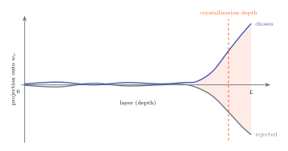
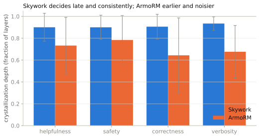

# Crystallization depth

Run a preference pair through the model and watch the margin at every layer. For most of the network, nothing. The two responses sit on top of each other, both near zero, the model apparently undecided. Then, late, the margin snaps open. There is a specific depth where the preference goes from "not yet" to "mostly there," and it is worth naming, because it turns out to be a stable, measurable property of a reward model.

**Crystallization depth** is the layer where the running margin first reaches half of its final value. Half the decision, made. `reward-lens` computes it for you as `crystallization_layer` on any trace.

{ .rl-fig }

/// caption
The idealized shape. Two completions' projections onto \(w_r\) run together and near zero through the early and middle layers, then split apart late. The dashed line is where the margin between them reaches half its final size. Real models look messier, but this is the pattern.
///

## The canonical pair crystallizes at layer 30 of 32

Here is the actual reward-lens output for our running example, the sky-is-blue pair, on Skywork:

{ .rl-fig }

/// caption
Top: each response's projection onto \(w_r\), layer by layer (the two absolute levels are drawn for intuition, but only the gap between them means anything). They stay tangled and near zero for most of the network, then the rejected answer (the sky "has always been blue") drops hard in the last stretch while the chosen answer holds. Bottom: the per-layer contribution to the margin, which is almost entirely the last few MLPs. The dotted line marks crystallization at layer 30, about 94% of the way through a 32-layer model.
///

Read the top panel first. For thirty layers the model is building representations, but not committing: the margin between the two answers is negligible. The commitment happens in the final tenth of the network. Read the bottom panel and you see where it comes from: a handful of late layers, with the last MLP doing most of the work. This is the shape you learn to expect on Skywork, and once you have seen it you will spot it on other models too.

## It is not one pair's quirk

A single pair is a point estimate, so the number to trust is the distribution. Across RewardBench, Skywork crystallizes late and consistently, at roughly 90% of depth on every dimension we measured:

{ .rl-fig }

/// caption
Skywork (mean crystallization fraction near 0.90 across helpfulness, safety, correctness, and verbosity, with small spread) decides in the last few layers, reliably. ArmoRM decides earlier and far less consistently, its error bars several times wider. "Late and sharp" is a property of a particular reward model, not of reward models in general.
///

That contrast is a real finding, not a curiosity. It says Skywork holds its judgment until the representations are nearly complete and then reads them off, while ArmoRM's gated multi-objective head commits earlier and with more variance. Crystallization depth is the measurement that lets you say that at all, and it has no clean analog in generative interpretability, where there is no single margin to track.

## What it is good for, and what it is not

Crystallization depth tells you *where to look*. If preference forms in the last three layers, that is where your attribution and your patching should concentrate, and running a full-depth head sweep on the early layers is mostly wasted compute. It is a triage tool.

What it is not is a causal claim. "The margin reaches half its value at layer 30" is a statement about where the reward *appears*, an observational fact about the projection. It does not follow that layer 30 *causes* the preference. In fact, on this pair, patching says the early layers carry more of the causal weight than the late ones, even though the late layers are where the margin visibly forms. That tension is the subject of the next page, and it is the single most important thing to understand before you trust any of these plots.

Next: the split that runs through the whole library. → [Observational vs causal](observational-vs-causal.md)
