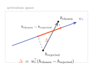

# Preference geometry

A reward model is trained on pairs. Someone wrote a prompt, someone judged one response better than another, and the model learned to score the better one higher. So the natural unit of analysis is not a single activation. It is two, and the relationship between them.

Put both responses through the model and you get two final hidden states, \(h_{\text{chosen}}\) and \(h_{\text{rejected}}\): two points in the same activation space. The model prefers chosen because it projects further along the reward direction. The amount by which it does is the **margin**:

\[
\Delta = r_{\text{chosen}} - r_{\text{rejected}} = w_r^{\top}\bigl(h_{\text{chosen}} - h_{\text{rejected}}\bigr)
\]

Notice what dropped out. The bias \(b\) is in both scores, so it cancels. The margin depends only on the *difference vector* \(h_{\text{chosen}} - h_{\text{rejected}}\), projected onto \(w_r\). The pair carries its own baseline.

{ .rl-fig .rl-fig--hero }

/// caption
Two activations, one difference vector, one projection. The margin is how much of the chosen-minus-rejected difference points along \(w_r\). Everything perpendicular to \(w_r\) is the model working, but not the model deciding.
///

## The pair is a controlled experiment you did not have to run

This is the quiet advantage of studying reward models. In generative interpretability you often have to construct a contrast: a clean run and a corrupted run, a prompt and a minimally edited counterfactual, and you worry whether your edit changed one thing or ten. A preference pair *is* the contrast, and it is the contrast the model was actually trained on. Chosen and rejected usually share the prompt, share the format, share most of the content, and differ in the one dimension the label is about. The difference vector isolates that dimension by construction.

That is why every signature in the library is pair-shaped. `score_pair` returns both scores. `trace` takes chosen and rejected together and returns their margin per layer. `attribute` decomposes the *difference* in reward, not one reward. When you patch, you swap a component from one member of the pair into the other. The pair is the experiment; the tools just read it from different angles.

```python
r_chosen, r_rejected = rm.score_pair(
    "A student asks: 'Why is the sky blue?' Please give a clear, accurate explanation.",
    "Sunlight is a mix of all visible wavelengths. When it enters Earth's atmosphere, "
    "molecules scatter the shorter (blue) wavelengths much more strongly ...",   # chosen
    "The sky is blue because blue is the color of the sky. It has always been blue ...",  # rejected
)
r_chosen - r_rejected      # the margin: about +24 on Skywork for this pair
```

## Contributions live in the same geometry

Because the readout is linear and the residual stream is a running sum of what every component wrote, the margin decomposes. Write the difference vector as the sum of per-component differences, \(h_{\text{chosen}} - h_{\text{rejected}} = \sum_c \delta_c\), and the margin splits into a signed contribution from each component:

\[
\Delta = \sum_c w_r^{\top} \delta_c
\]

Each term is one component's share of why chosen beat rejected: a positive number if that component pushed toward the better answer, negative if it pulled the other way. That decomposition is exactly what [Component Attribution](../tools/component-attribution.md) computes. It is cleaner than the generative case, where you decompose a distribution rather than a scalar. And it sets up the most important warning in these docs: a component's contribution to the margin, which is an observational quantity, does not have to match its causal importance. Hold that thought. It gets its own [page](observational-vs-causal.md).

Next: why the margin, and never the raw score, is the thing worth plotting. → [Why reward is relative](reward-is-relative.md)
