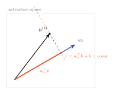

# The reward direction

What is a reward model actually computing when it hands back a score? Strip away the language model underneath and the answer is one line of linear algebra. The model runs a prompt and a response through a transformer, takes the final hidden state \(h\), and reads out a single number:

\[
r = w_r^{\top} h + b
\]

The vector \(w_r\) is the weight of the reward head. Everything the model has to say about "is this a good response" is compressed into how far \(h\) points along \(w_r\). That vector is the **reward direction**, and it is the object this whole library is organized around.

## Why the known direction is the whole point

In a generative model, the analogous move is the logit lens: project a hidden state onto the unembedding and read out a distribution over fifty thousand tokens. To interpret it you have to decide which tokens matter and how to summarize a distribution. There is no single "answer direction," there are as many as there are vocabulary items.

A reward model hands you the answer direction for free. It is not something you fit a probe to recover, with all the leakage and overfitting that invites. It is sitting in the reward head's weights, the same vector for every input, exact to the last bit. When you project an activation onto \(w_r\), you are not estimating what the model cares about. You are reading it.

That is the structural gift, and it is why reward models may be an easier interpretability target than the generative models they are trained from, not a harder one:

- The output is one scalar, so attribution has a single target instead of a distribution.
- The answer direction is known, so there is nothing to probe for.
- The training data is preference pairs, which are built-in controlled comparisons.
- A model organism costs one regression head on top of a base model, not a training run from scratch.

None of that makes the mechanism simple. It makes the mechanism *addressable*.

## Reading the direction off a model

`reward-lens` extracts \(w_r\) and \(b\) when you load a model, and exposes them directly.

```python
from reward_lens import RewardModel

rm = RewardModel.from_pretrained("Skywork/Skywork-Reward-Llama-3.1-8B-v0.2")

rm.reward_direction        # torch.Tensor of shape (d_model,) — this is w_r
rm.reward_bias             # float — this is b
rm.d_model, rm.n_layers    # 4096, 32 for Skywork
```

The core operation, projecting an activation onto the direction, is one method. Hand it any hidden state and it returns the reward that state would produce on its own:

```python
score = rm.project_onto_reward(h)   # w_r^T h + b, for h of shape (..., d_model)
```

Every observational tool in the library is built from exactly this call, applied to different activations: to each layer's residual stream (the [Reward Lens](../tools/reward-lens.md)), to each component's output ([Component Attribution](../tools/component-attribution.md)), to each dictionary feature ([SAE features](../tools/sae-features.md)), to an extracted concept direction ([Concept vectors](../tools/concept-vectors.md)).

{ .rl-fig .rl-fig--hero }

/// caption
The reward is the length of the shadow \(h\) casts on \(w_r\). The dashed line is a level set: every activation on it produces the same reward. Move an activation along that line and the score does not change; move it toward \(w_r\) and the score rises.
///

## The one caveat, stated early

The clean single-vector picture holds exactly for a model with one scalar head. It is an approximation for multi-objective models. ArmoRM, for instance, has nineteen objective heads and a learned gate that mixes them per input, so its "reward direction" is a single summary of nineteen directions that are not all pointing the same way. The [reward-term conflict](../tools/reward-conflict.md) tool exists precisely to measure how much that approximation costs, and the [honesty section](../caveats.md) says plainly where it breaks. For a single-head model like Skywork, \(w_r\) is exactly one vector, and the picture is exact.

Next: the reason we always work with a *pair* of activations rather than one, and why the difference between them is the quantity that means something. → [Preference geometry](preference-geometry.md)
