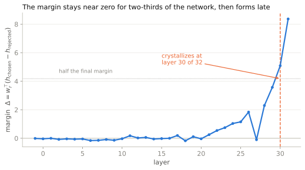

# Getting started

The fastest way to understand what this library is for is to run one pair through it and look at the result. Fifteen lines, one preference pair, and you will see where a reward model made up its mind and which parts of it wrote the score.

## Install

```bash
pip install reward-lens
```

That pulls in `torch`, `transformers`, and the rest. Python 3.10 or newer. For the sparse-autoencoder tooling, `pip install "reward-lens[sae]"`; for a dev checkout with tests, `pip install "reward-lens[dev]"`.

!!! note "What actually bites, before you run anything"
    - **You need the model weights.** `reward-lens` hooks a real model in memory, so anything API-only is out of reach. If `transformers` can load it, you can open it up.
    - **The good reward models are gated.** Skywork and ArmoRM live behind a license click on the Hugging Face Hub. Accept the terms on the model page, then `huggingface-cli login` with a token, or the load will fail with a 401.
    - **Budget the memory.** An 8B reward model in `bfloat16` wants about 16 GB of GPU memory for the observational tools (Reward Lens, attribution). A full [activation-patching](../tools/activation-patching.md) sweep runs a forward pass per component, so it wants more headroom and more time. Nemotron-340B needs several GPUs. Everything runs in inference mode; you never train the reward model.
    - **Which models just work.** Llama-based reward models (Skywork, FsfairX, QRM), Mistral, Gemma-2, InternLM2, ArmoRM's multi-objective head, and any `AutoModelForSequenceClassification` with a linear reward head through the generic adapter. Adding your own family is [one small class](../how-to/write-an-adapter.md).

## Your first trace

```python
from reward_lens import RewardModel
from reward_lens.lens import RewardLens
from reward_lens.attribution import ComponentAttribution

rm = RewardModel.from_pretrained("Skywork/Skywork-Reward-Llama-3.1-8B-v0.2")

prompt = "A student asks: 'Why is the sky blue?' Please give a clear, accurate explanation."
chosen = ("Sunlight is a mix of all visible wavelengths. When it enters Earth's atmosphere, "
          "molecules scatter the shorter (blue) wavelengths much more strongly than the longer "
          "(red) ones — this is Rayleigh scattering. Blue light bounces around the sky in every "
          "direction, so when you look up, blue is what reaches your eyes from almost everywhere.")
rejected = ("The sky is blue because blue is the color of the sky. It has always been blue and "
            "always will be. Nobody really knows why, it's just one of those things.")

# 1. When does the preference form?
trace = RewardLens(rm).trace(prompt, chosen, rejected)
print(f"margin: {trace.differential[-1]:+.2f}")            # +24.03
print(f"crystallizes at layer {trace.crystallization_layer} of {rm.n_layers}")   # 30 of 32

# 2. Which components wrote the score?
attrib = ComponentAttribution(rm).attribute(prompt, chosen, rejected)
for name, value in attrib.top_k(5, by="differential"):
    print(f"{name:>10}  {value:+.2f}")                     # mlp_L31 +3.99, mlp_L30 +1.32, ...
```

Run that and you have a real result: Skywork prefers the Rayleigh answer by a margin of about 24, it commits to that preference only in the last two layers, and the components that carry the largest share of the score are the final MLPs.

{ .rl-fig }

/// caption
What the trace looks like: the margin stays near zero for two-thirds of the network, then forms in a rush, crossing half its final value at layer 30. This shape, flat then late, is the thing to recognize.
///

That last fact is a trap, and learning why is the point of everything that follows. The components with the largest *attribution* are not the ones [causal patching](../tools/activation-patching.md) finds most *necessary*. On this pair they anti-correlate. The [observational-vs-causal](../concepts/observational-vs-causal.md) split is the first idea to internalize, and the [honesty section](../caveats.md) is where the library keeps itself honest about it.

## Where to go next

<div class="grid cards" markdown>

-   __Understand the idea__

    Five short pages that install the mental model the whole library assumes.

    [:octicons-arrow-right-24: Concepts](../concepts/index.md)

-   __Follow the curriculum__

    The intro notebook runs the full arc on one pair, end to end, with a free Colab GPU.

    [:octicons-arrow-right-24: Tutorials](../tutorials/index.md)

-   __Do one specific thing__

    Goal-indexed recipes: detect length bias, compare two models, write an adapter.

    [:octicons-arrow-right-24: How-to guides](../how-to/index.md)

-   __Open a tool__

    Every tool, grouped by what claim it lets you make.

    [:octicons-arrow-right-24: Tools](../tools/index.md)

</div>
