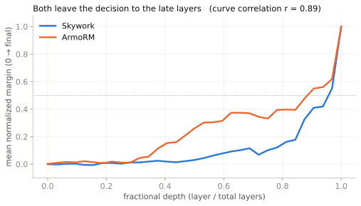

# Compare two reward models

You want to see where and how two reward models form the same preference: do they commit at the same depth, and do they build the margin the same way?

Hand `ModelComparator` a dict of loaded models and one pair. It runs the reward lens and attribution on each and lines them up.

```python
from reward_lens import RewardModel
from reward_lens.comparison import ModelComparator

skywork = RewardModel.from_pretrained("Skywork/Skywork-Reward-Llama-3.1-8B-v0.2")
armo    = RewardModel.from_pretrained("RLHFlow/ArmoRM-Llama3-8B-v0.1")

prompt = "A student asks: 'Why is the sky blue?' Please give a clear, accurate explanation."
chosen = ("Sunlight is a mix of all visible wavelengths. When it enters Earth's atmosphere, "
          "molecules scatter the shorter (blue) wavelengths much more strongly than the longer "
          "(red) ones — this is Rayleigh scattering. Blue light bounces around the sky in every "
          "direction, so when you look up, blue is what reaches your eyes from almost everywhere.")
rejected = ("The sky is blue because blue is the color of the sky. It has always been blue and "
            "always will be. Nobody really knows why, it's just one of those things.")

result = ModelComparator({"skywork": skywork, "armo": armo}).compare(prompt, chosen, rejected)

result.crystallization_layers    # {"skywork": ~0.94, "armo": ~0.61}  (fraction of depth)
result.formation_correlations    # {("skywork", "armo"): ~0.85}       (Pearson of the curves)
result.print_summary()
```

On this pair Skywork does not commit until about 94% of the way through the network; ArmoRM settles far earlier, around 61%. Their normalized formation curves still correlate at about 0.85: same shape, different crystallization depth. The two models build the preference the same way and just finish at different points.

{ .rl-fig }

/// caption
Each curve is one model's margin by layer, normalized to its final value. They rise together through the middle of the stack, then Skywork holds off crystallizing until the very end while ArmoRM has already committed.
///

Read the gap horizontally, not vertically: same trajectory, Skywork just delays its decision.

## Fit two 8B models on one GPU

`ModelComparator` needs both models resident at once, roughly 32 GB for two 8B models in bfloat16. If you have room for only one, run them one at a time and free the first before loading the second. `compare` is a reward-lens trace per model plus a correlation of the two curves, so you can reproduce it by hand:

```python
import gc, torch
from reward_lens import RewardModel
from reward_lens.lens import RewardLens

rm = RewardModel.from_pretrained("Skywork/Skywork-Reward-Llama-3.1-8B-v0.2")
skywork_curve = RewardLens(rm).trace(prompt, chosen, rejected).differential

del rm
gc.collect()
torch.cuda.empty_cache()

rm = RewardModel.from_pretrained("RLHFlow/ArmoRM-Llama3-8B-v0.1")
armo_curve = RewardLens(rm).trace(prompt, chosen, rejected).differential
```

With both `differential` curves saved you normalize and correlate them yourself, which is exactly what `formation_correlations` reports.

!!! note "The free step is the whole trick"
    Without `del rm; gc.collect(); torch.cuda.empty_cache()` the first model's weights stay pinned and the second load runs out of memory. ArmoRM also wants `trust_remote_code=True`, which `from_pretrained` sets by default.

See also: [Reward Lens](../tools/reward-lens.md), [crystallization depth](../concepts/crystallization.md).
