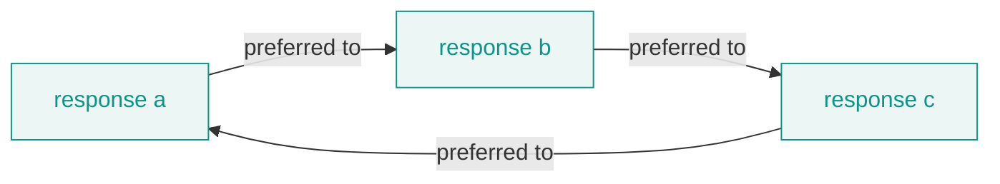

# The Bradley-Terry model

Where does the reward model's number come from? Not from a rule anyone wrote down. It comes from fitting one specific probabilistic model to pairs of human judgments, and you inherit that model's assumptions the moment you load the weights.

## The model

Reward models are trained under the Bradley-Terry model of paired comparison (Bradley and Terry, 1952, "Rank Analysis of Incomplete Block Designs: I. The Method of Paired Comparisons," *Biometrika*). It posits a single latent quality \(r(y)\) for every response and says the probability a human prefers \(y_1\) over \(y_2\) is a sigmoid of the gap between those qualities:

\[
P(y_1 \succ y_2) = \sigma\bigl(r(y_1) - r(y_2)\bigr)
\]

The reward head is trained to make that probability match the data. Given a set of pairs where \(y^{+}\) was chosen over \(y^{-}\), you maximize the likelihood of the observed choices, which is the same as minimizing the negative log-likelihood:

\[
\mathcal{L} = -\sum_{(y^{+},\,y^{-})} \log \sigma\bigl(r(y^{+}) - r(y^{-})\bigr)
\]

Every gradient step pushes the chosen response's reward up and the rejected one's down, but only relative to each other. The loss never sees a reward on its own. It only ever sees a difference.

## What the fit can and cannot pin down

That last sentence has a consequence the [concepts page on relative reward](../concepts/reward-is-relative.md) works through in full, so here is only the load-bearing version. Add the same constant to every reward the model outputs and every gap \(r(y^{+}) - r(y^{-})\) is unchanged, so the likelihood is identical. The absolute level is not identified. Only margins carry information, which is why every figure in these docs plots a difference \(\Delta\) and never a level.

The sigmoid does pin the scale, since its slope is fixed at one, so within a single trained model the reward is determined up to that one additive constant. Across models the numeric ranges still diverge widely, Skywork emitting raw logits near \(\pm 30\) and ArmoRM a gated score near zero, for architectural reasons rather than because one model is more certain than the other. Compare models with scale-free statistics, never raw scores.

## Where the assumptions leak

Bradley-Terry is a strong model, and its strength is exactly where it can be wrong. Two assumptions do the work, and real preference data strains both.

**One scalar quality.** The model compresses "how good is this response" into a single number \(r(y)\). That presumes the axes of quality collapse onto one line without losing the ordering. Often they do not. Helpfulness, safety, and brevity trade against each other, and a pair can be better on one axis and worse on another. The library's own multi-objective model makes the strain visible: ArmoRM carries nineteen objective directions, and their pairwise cosines run from strongly aligned (objectives 0 and 1 at 0.82) down to near-orthogonal (objectives 0 and 10 at -0.02). Collapsing nineteen not-all-aligned directions to one scalar is a summary, not an identity. The [reward-term conflict](../tools/reward-conflict.md) tool exists to measure that geometry rather than pretend it away.

**A consistent ordering (stochastic transitivity).** If \(r\) is a single number, preferences must be transitive: if the model says \(a \succ b\) and \(b \succ c\), it is forced to say \(a \succ c\). Human preferences are not always so orderly. Individual judgments can cycle, and even when each annotator is internally consistent, pooling a group with different orderings can produce a collective cycle that no single scalar can represent.

A preference cycle. No assignment of a single quality number to \(a\), \(b\), and \(c\) can reproduce all three arrows at once, so Bradley-Terry cannot fit this pattern. It settles for the ordering that violates the data least, and the residual is disagreement it had to discard.

**One latent judge.** The training pairs are labeled by many people who do not agree. Bradley-Terry fits one latent preference to all of them, so genuine disagreement is averaged into a single scale as if it were one judge with noise. Where annotators split along real lines (culture, expertise, values), the averaged reward represents no one of them exactly.

None of this is a reason to distrust a reward model. It is a reason to know what kind of object it is. The leaks are known well enough that alternative formulations exist which drop the scalar-and-transitive assumption entirely, treating alignment as a game over a general preference relation instead of a fitted reward (Munos et al., 2023, "Nash Learning from Human Feedback," arXiv [2312.00886](https://arxiv.org/abs/2312.00886)). `reward-lens` does not require that. It takes the trained Bradley-Terry reward model as given and reads its geometry. But these are the reasons the reward is a proxy and never quite the target itself, which is where [overoptimization](goodhart.md) begins.
