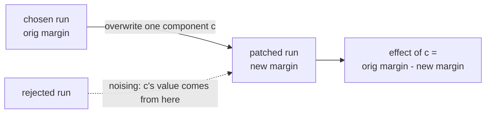
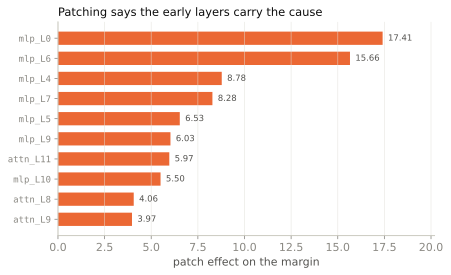

<span class="rl-badge rl-badge--causal">Causal</span>

# Activation Patching

**Which components are causally necessary for the preference?**

Attribution shows you where the reward is visible. It cannot show you what put it there, and on real reward models those are not the same layers. To get a cause you have to intervene: reach into the model, change one component, run it again, and see whether the margin moves. That is activation patching. It is the tool that earns the word *causal* everywhere else in these docs, and the counterweight to every attribution bar, because an attribution bar is a correlation and this is not.

The move is a swap. Run the chosen and rejected completions through the model and you are holding two full sets of activations. Take one component, say the MLP at layer 6, and in the chosen run overwrite its output with the value it had in the rejected run. Leave everything else alone. Re-read the margin. If it falls, that component was doing real work to keep the chosen answer ahead. If it does not move, the component was along for the ride.

## The swap



Only the margin means anything, \(\Delta = \text{reward(chosen)} - \text{reward(rejected)}\), because a [Bradley-Terry](../theory/bradley-terry.md) model is invariant to shifting both scores together. Call the untouched margin \(\Delta_{\text{orig}}\). Patch component \(c\) and the effect is how much of that margin the swap destroyed:

\[
\text{effect}(c) = \Delta_{\text{orig}} - \Delta_{\text{patch}(c)}
\]

Positive means the swap pulled the margin down, so the component was holding it up: it matters. That subtraction is exactly `patch_effects = original_differential - patched_differential` on the result.

The value you swap in is the *mode*, and the mode sets the question.

| mode | what it injects | the question |
| --- | --- | --- |
| `noising` | the rejected run's value for \(c\) into the chosen run | Is \(c\) **necessary**? Break it and watch the margin fall. |
| `denoising` | the chosen run's value for \(c\) into the rejected run | Is \(c\) **sufficient**? Supply it alone and watch the margin recover. |
| `zero` | zeros | What does the margin lose if \(c\) contributes nothing at all? |
| `mean` | \(c\)'s average activation over a corpus | The same test, against a realistic baseline instead of a hard zero. |

Necessity and sufficiency are different claims, and a component can pass one while failing the other, so the mode is a real choice rather than a default to accept blindly. Noising is the usual first pass.

## A worked run

```python
from reward_lens import RewardModel, ActivationPatcher

rm = RewardModel.from_pretrained("Skywork/Skywork-Reward-Llama-3.1-8B-v0.2")
patcher = ActivationPatcher(rm)

prompt = "A student asks: 'Why is the sky blue?' Please give a clear, accurate explanation."
chosen = ("Sunlight is a mix of all visible wavelengths. When it enters Earth's atmosphere, "
          "molecules scatter the shorter (blue) wavelengths much more strongly than the longer "
          "(red) ones — this is Rayleigh scattering. Blue light bounces around the sky in every "
          "direction, so when you look up, blue is what reaches your eyes from almost everywhere.")
rejected = ("The sky is blue because blue is the color of the sky. It has always been blue and "
            "always will be. Nobody really knows why, it's just one of those things.")

result = patcher.patch_all_components(prompt, chosen, rejected, mode="noising")

result.top_k(5)
# [('mlp_L0', 17.41), ('mlp_L6', 15.66), ('mlp_L4', 8.78), ('mlp_L7', 8.28), ('mlp_L5', 6.53)]
result.original_differential     # +24.03, the full margin
result.plot_top_k()
```

{ .rl-fig }

/// caption
Noising patch effects for the canonical pair, largest first. `mlp_L0` leads at +17.41, and every tall bar belongs to the first third of the network. Attention shows up early too (`attn_L11` +5.97, `attn_L8` +4.06). Nothing from the late layers reaches the top of the chart.
///

Read each bar's height as causal weight: overwrite `mlp_L0` with its rejected-run value and the +24.03 margin loses 17.41 of itself. The reward you read out at the end is built at the front.

## How to read it

Now line this up against attribution on the very same pair. Attribution's top components are all *late*: `mlp_L31` +3.99, `mlp_L30` +1.32, `mlp_L29` +0.86. Patching's are all *early*. Rank the 64 components by each method and correlate the two rankings, and they do not merely fail to agree, they invert: Spearman \(\rho = -0.230\) on this pair, and \(-0.256\) averaged over helpfulness, correctness and safety on Skywork. Never positive.

The reason is [crystallization](../concepts/crystallization.md). The margin becomes *visible* in the last layers, which is what attribution measures, but it is *computed* in the early ones, which is what patching needs. Break an early layer and every layer downstream inherits the error. Break the last MLP and the model mostly recovers. A tall attribution bar and a tall patch effect are answers to two different questions, and on real reward models they land in different halves of the network. The full scatter lives on [observational vs causal](../concepts/observational-vs-causal.md); this contrast is the result the whole library is organized around.

## Down to single heads

`patch_all_components` sweeps attention and MLP blocks. For finer grain, `patch_all_heads(prompt, chosen, rejected, mode="noising")` patches every head one at a time, and it works even though head-level *attribution* does not (`ComponentAttribution.attribute_heads` is unavailable). One wrinkle: a head result's `.plot()` draws the attention-and-MLP heatmap and so comes back empty for heads, so read head results with `.top_k()` or `.plot_top_k()` instead. Head-level patching supports `noising` and `denoising` only. When you already have a suspect, `patch_single_component(prompt, chosen, rejected, layer_idx=6, component_type="mlp")` returns that one effect as a float.

## When to reach for it, and when not

Reach for patching the moment a claim turns causal: "this head carries the length bias," "this circuit implements the preference." Attribution and the [reward lens](reward-lens.md) are for finding suspects fast; patching is for convicting one. If you have not patched, you do not have a cause.

The catch is that the swap can lie. Injecting the rejected run's value for a component into the chosen run can produce an activation the model would never reach on any real input, and the margin you read off that state describes a counterfactual the model never faces. A large effect from a badly off-distribution patch is not a large cause. When an effect is surprising or load-bearing, rerun it through [divergence-aware patching](divergence-patching.md), which measures how far each patched activation strays from the model's own distribution and attaches a reliability score.

## Reference

Full signatures and modes: [`ActivationPatcher`](../reference/causal.md#reward_lens.patching.ActivationPatcher).
