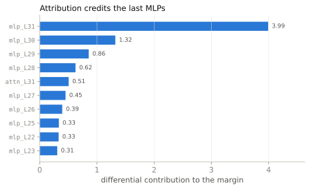

<span class="rl-badge rl-badge--observational">Observational</span>

# Component Attribution

**Which heads and MLPs actually wrote the score?**

The reward lens tells you which *layers* the margin forms in. This goes one level finer. It splits the final reward into a signed contribution from every component, every attention block and every MLP, so you can read off who pushed the score up and who pushed it down. The residual stream is a running sum of these writes, and the reward is linear in that sum, so the split is exact. Nothing is left over.

Why care, once you already have the lens? Because "layer 30 decides" is a coarse answer. If you want to know whether the MLPs or the attention are carrying the preference, or which single block wrote most of the margin, attribution hands you the itemized bill.

## The math

Write the final hidden state as the sum of what each component wrote into the residual stream, \( h = \sum_c o_c \). The reward reads out along one direction, so it distributes over that sum:

\[ r = w_r^{\top} h + b = \sum_c \bigl(w_r^{\top} o_c\bigr) + b \]

Each term \( w_r^{\top} o_c \) is component \(c\)'s contribution to the score. For a preference pair the bias cancels and the margin becomes a clean sum of signed shares:

\[ \Delta = \sum_c w_r^{\top} \delta_c, \qquad \delta_c = o_c^{\text{chosen}} - o_c^{\text{rejected}} \]

A positive \( w_r^{\top}\delta_c \) means component \(c\) moved the chosen answer ahead of the rejected one. A negative one means it worked against the eventual winner. Add every term and you recover the full margin, to the last decimal.

## A worked run

Same sky-is-blue pair, one call.

```python
from reward_lens import RewardModel, ComponentAttribution

rm = RewardModel.from_pretrained("Skywork/Skywork-Reward-Llama-3.1-8B-v0.2")
attr = ComponentAttribution(rm)

prompt = "A student asks: 'Why is the sky blue?' Please give a clear, accurate explanation."
chosen = ("Sunlight is a mix of all visible wavelengths. When it enters Earth's atmosphere, "
          "molecules scatter the shorter (blue) wavelengths much more strongly than the longer "
          "(red) ones — this is Rayleigh scattering. Blue light bounces around the sky in every "
          "direction, so when you look up, blue is what reaches your eyes from almost everywhere.")
rejected = ("The sky is blue because blue is the color of the sky. It has always been blue and "
            "always will be. Nobody really knows why, it's just one of those things.")

result = attr.attribute(prompt, chosen, rejected)
result.top_k(5, by="differential")
```

```text
[('mlp_L31', 3.99), ('mlp_L30', 1.32), ('mlp_L29', 0.86),
 ('mlp_L28', 0.63), ('attn_L31', 0.51)]
```

The five largest contributors all sit in the last four layers, and four of the five are MLPs. `top_k` sorts by absolute value, so a large negative contributor would surface here too; on this pair the top of the list is all positive, the late blocks piling onto the winner. `result.by_type("mlp")` pulls just the MLP contributions, `result.plot_top_k()` draws the ranked bars below, and `result.plot_heatmap()` lays the whole model out as a two-row grid, attention over MLP, layer by layer.

{ .rl-fig }

/// caption
Each bar is one component's signed contribution \( w_r^{\top}\delta_c \) to the margin, largest first, so a taller bar wrote more of the score. The bars are late (layers 28 to 31) and mostly MLPs, the same last-few-layers story crystallization tells, now resolved to individual blocks. `mlp_L31` alone accounts for about 4 of the 24-point margin.
///

## How to read it

- **Sign is direction.** Positive helped the chosen answer, negative fought it. Most components sit near zero and do not matter to this pair.
- **Magnitude is share.** The bars are in reward units and sum to the margin, so "mlp_L31 wrote about a sixth of it" is a literal statement, not a figure of speech.
- **Type is mechanism.** MLPs dominating means the preference is written by the position-wise computation; attention dominating would mean it is being moved between positions. Here it is MLPs, decisively.

## When to reach for it, and when not

Reach for attribution right after the reward lens, once the lens has shown you *where* the margin forms and you want to know *which components* inside that region carry it. It is one forward pass per member of the pair, cheap enough to run on everything, and its output is an exact decomposition rather than an estimate.

Do not read it as causal, and this is not a soft warning. Attribution credits the components with the largest projection onto \(w_r\), which on Skywork are the last MLPs, because that is where the margin is largest to begin with. Patching, which actually intervenes, credits the *early* layers, because that is where the computation the late layers merely report on gets done. Ranked against each other on this exact pair the two anti-correlate at Spearman \( \rho = -0.230 \), and averaged over helpfulness, correctness, and safety the anti-correlation holds at \( \rho = -0.256 \) on Skywork. So a tall attribution bar is a hypothesis about importance, not a demonstration of it. If the claim matters, confirm it with [activation patching](activation-patching.md). The full accounting is in [observational vs causal](../concepts/observational-vs-causal.md).

One more limit, a concrete one: there is no head-level attribution. The residual-stream decomposition is exact at the block level, one number per attention layer and one per MLP, but splitting an attention block into its individual heads is not something this tool does. If you need per-head granularity, the causal route has it. [`ActivationPatcher.patch_all_heads`](activation-patching.md) sweeps every head and measures each one's effect directly.

## Reference

Full signatures and return types: [`ComponentAttribution`](../reference/core.md#reward_lens.attribution.ComponentAttribution).
