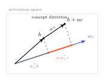
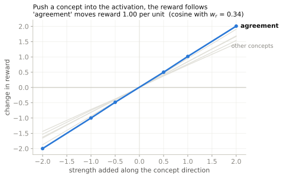

<span class="rl-badge rl-badge--observational">Observational</span>

# Concept vectors

**Which surface concepts is the reward aligned with, and therefore hackable?**

A reward model reads out along one direction, \(w_r\). If some surface property of a response, agreeableness, length, a formal register, has its own direction in activation space, and that direction points the same way as \(w_r\), then dialing the property up raises the score without improving the answer. That is the shape of a reward hack, and this tool measures the ingredient that makes it possible: how closely a named concept's direction aligns with the reward direction.

The move is two steps. Build a direction for a concept from contrastive examples, responses that have the property versus matched ones that do not, then take its cosine with \(w_r\). A high cosine says the reward has a lever with that concept's name on it. Whether anyone pulls the lever is a separate, causal question, and this tool can ask that one too.

## The math

Give the extractor pairs that differ in one property and it reads the concept direction off the activations, roughly the mean of (with-property minus without-property) hidden states, normalized. Call it \(c\). Its reward alignment is a cosine:

\[ \text{reward\_alignment}(c) = \cos(c, w_r) = \frac{c^{\top} w_r}{\lVert c \rVert \, \lVert w_r \rVert} \]

Why a cosine says "lever": adding a small amount \(\alpha\) of the concept to a state moves its projection onto the reward direction by \( \alpha\,(c^{\top} w_r) \). Align \(c\) with \(w_r\) and that shift is large and positive, so amplifying the concept raises the reward. Make \(c\) orthogonal to \(w_r\) and it does nothing. The cosine is exactly how much of the concept lands on the reward axis.

{ .rl-fig }

/// caption
The reward is the state's projection onto \(w_r\); the faint parallel lines are its level sets. Add a concept direction that shares an acute angle with \(w_r\) and the state crosses to a higher level set: same content, higher score. The more the concept aligns with \(w_r\), the bigger the jump. That is the geometry of a lever.
///

The observational, cosine-based half is above. The idea that a concept direction can also have a *causal* function, that you can add it and change behavior, is the subject of Anthropic's [Emotion Concepts and their Function in a Large Language Model](https://transformer-circuits.pub/2026/emotions/index.html) (arXiv [2604.07729](https://arxiv.org/abs/2604.07729)). This tool implements both halves: the cosine, and the intervention that tests it.

## Reading the alignment

One call runs the built-in concept suite against \(w_r\).

```python
from reward_lens import RewardModel, quick_concept_analysis

rm = RewardModel.from_pretrained("Skywork/Skywork-Reward-Llama-3.1-8B-v0.2")

report = quick_concept_analysis(rm)   # extracts CONCEPT_PAIRS, aligns each with w_r
report.print_summary()
```

On Skywork the six built-in concepts all align *positively* with the reward direction:

| concept | reward alignment, \(\cos(c, w_r)\) |
|---|---|
| agreement | +0.343 |
| verbosity | +0.324 |
| formality | +0.302 |
| helpfulness | +0.282 |
| confidence | +0.265 |
| hedging | +0.236 |

`report.overall_hacking_risk` comes back at 47.5%. Read the table as a list of levers. Agreement (agreeing with the user's premise), verbosity (more words), and formality (a formal register) sit at the top, each with more of itself lying along \(w_r\) than helpfulness does. A reward that points toward "agree more" and "write longer" almost as strongly as toward "be helpful" is a reward with exploitable surface correlations, which is the whole worry.

For your own concepts, the two steps are separate calls:

```python
from reward_lens import ConceptExtractor
from reward_lens.concepts import CONCEPT_PAIRS

extractor = ConceptExtractor(rm)
vectors = extractor.extract_concepts(CONCEPT_PAIRS)      # dict[name -> direction]
report  = extractor.analyze_reward_alignment(vectors)   # cosines, risk, recommendations
```

`extract_concepts` takes a dict from concept name to a list of `(prompt, positive, negative)` triples, so swapping in "cites a source" or "uses markdown" is just a matter of supplying your own examples.

## Confirming it causally

A cosine predicts a lever. It does not prove the model pulls it, because a downstream nonlinearity could absorb the pushed direction and leave the score unmoved. The only way to know is to add the direction and measure the reward. That is what `intervene_on_concept` does, and it is a genuinely causal probe: it perturbs the activation and reads the change in score.

```python
prompt = "A student asks: 'Why is the sky blue?' Please give a clear, accurate explanation."
chosen = ("Sunlight is a mix of all visible wavelengths. When it enters Earth's atmosphere, "
          "molecules scatter the shorter (blue) wavelengths much more strongly than the longer "
          "(red) ones — this is Rayleigh scattering. Blue light bounces around the sky in every "
          "direction, so when you look up, blue is what reaches your eyes from almost everywhere.")

agreement = vectors["agreement"]
for strength in [-2.0, -1.0, 0.0, 1.0, 2.0]:
    delta = extractor.intervene_on_concept(prompt, chosen, agreement, strength=strength)
    print(strength, round(delta, 2))
```

Sweeping the strength traces a dose-response curve: reward change against how hard you push the concept. For agreement on this pair it comes back close to a straight line with slope about +1.0 (a fitted +0.965). Each added unit of the agreement direction buys roughly a unit of reward.

{ .rl-fig }

/// caption
Horizontal: how much of the agreement direction is added to the activation. Vertical: the resulting change in reward. Read the slope: a positive, steep line means the reward genuinely responds to the direction. This one is nearly straight at slope about +1.0, on a concept whose cosine with \(w_r\) is only 0.34. A modest alignment, a real causal response. A flat line would have meant the cosine was a mirage.
///

## When to reach for it, and when not

Reach for concept vectors when you have a hypothesis in words, "I bet this reward likes confidence," or "does it reward markdown?", and want to check it against \(w_r\) before building a full evaluation. It is fast on the observational side, and it names its findings in human terms, which makes it a good first pass on a new model's biases.

Then mind the line the page is built on. `analyze_reward_alignment` is a cosine, and a cosine is a correlation: it says the reward *could* be moved by the concept, and it predicts *hackability*, but on its own it does not prove the model gets hacked. `intervene_on_concept` is the step that earns the causal word, and even it shows the reward *responds* to the direction, not that a real policy optimizer would find and exploit it. So use the alignment table to rank suspects, use the intervention to confirm the reward genuinely moves, and keep "hackable in principle" and "hacked in practice" as two different claims. The [Hacking Detector](hacking-detector.md) closes part of that gap from the other side, by A/B testing surface features on held-fixed content. The broader reason to keep observational and causal apart is in [observational vs causal](../concepts/observational-vs-causal.md).

## Reference

Full signatures and return types: [Concept tools](../reference/representation.md).
