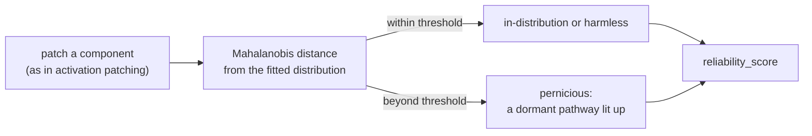

<span class="rl-badge rl-badge--causal">Causal</span>

# Divergence-aware Patching

**Is this causal claim built on an activation the model actually reaches?**

Every causal number in these docs comes from a swap, and a swap can cheat. When you overwrite one component's activation with a value from another run, the state you build may be one the model would never produce on its own. The reward you read off it is real arithmetic on an unreal input, and it can light up a circuit that never co-occurs when the model runs normally. The patch effect looks like a cause. It may be an artifact of a representation the model does not visit.

This tool is that worry turned into a measurement. It is a subclass of [activation patching](activation-patching.md) that does the same swaps and, for each one, asks a second question: did this patched activation land somewhere the model actually goes? Every effect it returns arrives with a note on how far off-distribution the intervention was.

## The check



First you fit a reference distribution from clean, unpatched activations. Then each patched activation is scored by its Mahalanobis distance from that distribution, which is just how many standard deviations off-center it sits once you account for the way the activations naturally co-vary. Anything past the threshold is flagged as divergent, and divergent splits two ways. A *harmless* divergence is off-distribution but changes nothing you care about. A *pernicious* one activates a pathway that stays dormant on real inputs, which is exactly the case that turns a patch effect into a fiction. The `reliability_score` is the share of effects that are not pernicious, so 1.0 says trust the run and a low number says some of the causal claims rest on states the model never reaches. The harmless-versus-pernicious distinction is from Grant et al., [*Addressing divergent representations from causal interventions on neural networks*](https://arxiv.org/abs/2511.04638).

## A worked run

Fit first, then patch. The fit needs clean text, and the shipped diagnostic set is enough to start.

```python
from reward_lens import RewardModel, DivergenceAwarePatching
from reward_lens.diagnostic_data import get_all_prompts_and_responses

rm = RewardModel.from_pretrained("Skywork/Skywork-Reward-Llama-3.1-8B-v0.2")
dap = DivergenceAwarePatching(rm)

# 1. Build the reference distribution from unpatched activations. Do this first.
rows = get_all_prompts_and_responses()
dap.fit_distribution(
    prompts=[r["prompt"] for r in rows],
    responses=[r["response"] for r in rows],
)

# 2. Patch, and score every intervention against that distribution.
result = dap.patch_with_divergence_check(
    prompt, chosen, rejected,
    mode="noising",
    divergence_threshold=2.0,   # Mahalanobis distance, in standard deviations
)

result.reliability_score         # 0 to 1: the share of effects that are not pernicious
result.has_pernicious_divergence # True if any intervention lit a dormant pathway
result.divergent_components      # the component names that landed off-distribution
result.print_divergence_summary()
result.plot_with_divergence()
```

`patch_with_divergence_check` returns everything a normal patch does, `patch_effects` and `top_k` included, plus the divergence fields. Causal effects and their reliability come off the same object.

## How to read it

Start at `reliability_score`. Near 1.0 and the run's causal numbers are safe to quote. Below that, open `divergent_components` and cross it against your top effects. The case that should stop you is a large patch effect whose component also appears in the divergent list with a pernicious type: that is a big causal claim resting on a state the model does not reach, and `print_divergence_summary` will spell it out. A large effect on an in-distribution component is the opposite, a result you can lean on. Raising `divergence_threshold` flags fewer components and trusts the swap more; lower it when you want to be strict.

## When to reach for it

Use it whenever a patch effect is surprising or about to hold weight in a writeup. You do not need it for a first sweep, where ordinary [activation patching](activation-patching.md) is faster, but the moment an effect becomes a claim, this is how you check that the claim is about the model and not about an artifact of the intervention. The rest of the honest limits live in [interpreting results honestly](../caveats.md); this page is one of them, built into a tool so the check travels with the number.

## Reference

Full signatures and the divergence fields: [`DivergenceAwarePatching`](../reference/causal.md#reward_lens.divergence_patching.DivergenceAwarePatching).
