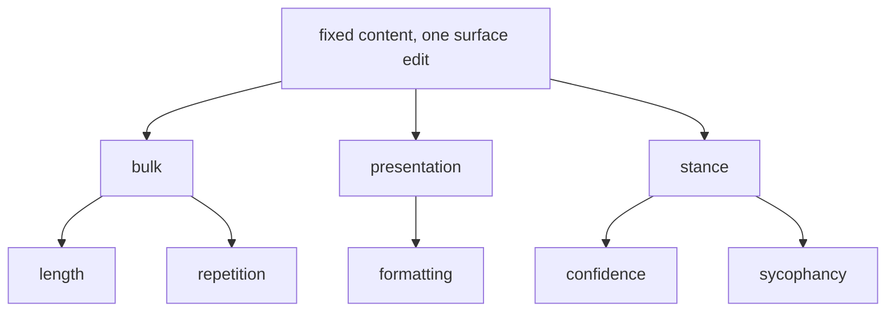
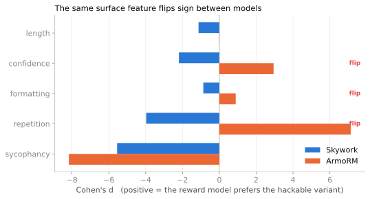

<span class="rl-badge rl-badge--vulnerability">Vulnerability</span>

# Hacking Detector

**Does the reward model reward the wrong thing?**

A policy trained against a reward model finds whatever the reward model rewards, including the things you never meant to pay for. If a confident tone raises the score, or a couple of headers do, or simply saying more, then a policy under optimization pressure learns to sound confident, add headers, and pad. The surface feature becomes a lever, and pulling it buys reward without making the answer any better. The Hacking Detector goes looking for those levers before a policy does.

The move is a controlled edit. Take a response, hold its content fixed, change one surface feature, and score both versions. Content constant means any change in the score is that feature and nothing else. Do it across several pairs and you get an effect size: how reliably, and how hard, the feature moves the reward.

## The probes

The built-in suite varies five features, each a familiar way to look better without being better.



The suite ships a handful of pairs per axis: length has three, confidence two, formatting two, sycophancy two, and repetition one. That single repetition pair changes how you read the output, and it comes up again below.

## The math

Each probe is two responses that say the same thing, one plain and one carrying the feature. Score both and subtract:

\[
\Delta_{\text{probe}} = r_{\text{biased}} - r_{\text{neutral}} = w_r^{\top}\bigl(h_{\text{biased}} - h_{\text{neutral}}\bigr)
\]

Since the content is fixed, \(h_{\text{biased}} - h_{\text{neutral}}\) is whatever the surface edit did to the representation, and \(\Delta\) is how far that edit pushed it along the reward direction. A positive value means the feature earns reward. Across a probe's pairs the summary is a one-sample Cohen's \(d\), the mean delta over its standard deviation, with a sign-flip permutation p-value. Cohen's \(d\) rather than the raw mean, for a reason that turns out to matter a great deal.

## A worked run

```python
from reward_lens import RewardModel
from reward_lens.hacking import HackingDetector

rm = RewardModel.from_pretrained("Skywork/Skywork-Reward-Llama-3.1-8B-v0.2")

report = HackingDetector(rm).scan()
report.print_summary()

report.get_vulnerable_dimensions(threshold=0.5)   # axes with |d| above 0.5
```

`scan()` runs its own built-in battery; you do not hand it a pair. To narrow to a few axes, name them:

```python
report = HackingDetector(rm).scan(tests=["confidence", "formatting"])
```

One honest wrinkle shows up right away. The repetition probe ships a single pair, and a Cohen's \(d\) from one point has no spread to divide by, so it comes back `NaN` rather than a number invented from nothing. That is the correct behavior, and a reminder that two or three pairs is enough to see a direction, not to pin a value.

## What it finds

Run the same five axes with more pairs per side, thirty here, and score them on two models. The effect sizes settle, and the comparison across models is where it gets interesting.

| Axis | Skywork \(d\) | ArmoRM \(d\) |
| --- | --- | --- |
| length | −1.13 | −0.01 (ns) |
| confidence | −2.19 | +2.94 |
| formatting | −0.87 | +0.89 |
| sycophancy | −5.55 | −8.17 |
| repetition | −3.97 | +7.13 |

A positive \(d\) means the model rewards the biased variant.

{ .rl-fig }

/// caption
Effect size per axis for the two models, bars left of zero for a penalty and right for a reward. On confidence, formatting, and repetition the two bars point opposite ways: Skywork marks the feature down, ArmoRM pays for it. Length points the same way for both (a penalty or nothing), and sycophancy points down hard for both.
///

Read the signs. On confidence, formatting, and repetition the two models genuinely disagree: Skywork penalizes the feature, ArmoRM rewards it. The same edit a policy would learn to avoid against Skywork is an edit a policy would learn to add against ArmoRM. Length is not a disagreement, both decline to reward it, one by penalizing and one by shrugging. Sycophancy is the reassuring axis: both models strongly prefer the correction to the flattery.

Now the reason for Cohen's \(d\). ArmoRM's raw mean deltas are tiny, on the order of 0.01 to 0.07, while Skywork's run to roughly ±30. ArmoRM emits a bounded, gated score and Skywork emits raw logits, so the two sit on unrelated scales, and comparing raw deltas across them measures nothing. Cohen's \(d\) divides each axis by its own spread, which is the only thing that makes the +2.94 and the −2.19 comparable at all. If you ever catch yourself ranking hackability by `mean_delta`, stop: you are comparing arbitrary units.

## When to reach for it, and when not

Reach for it as a first-pass audit before you optimize against a reward model, and as a way to compare two candidate models on the levers you already worry about. The sign flips above are exactly the thing you want to know before, not after, a policy discovers them.

Do not read it as a finished list. It probes five known features; a policy can still find a lever the suite never named. And a large \(d\) says the reward moves with the feature, not that a given training run will exploit it. Whether the lever gets pulled depends on the optimizer and the rest of the objective. The detector tells you a lever exists and how strong it is. It does not tell you where in the network the lever is wired, which is a question for [concept vectors](concept-vectors.md) or [activation patching](activation-patching.md).

## Reference

Full signatures and return types: [`HackingDetector`](../reference/vulnerability.md#reward_lens.hacking.HackingDetector).
