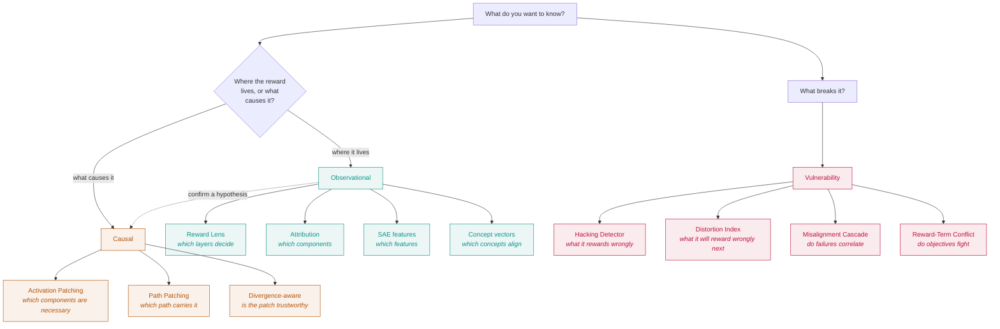

# Tools

Eleven tools, one idea. Every one of them is a projection onto the reward direction \(w_r\) or a decomposition along it. What separates them is the *question* they answer, and the strength of *claim* they let you make.

That last part is why every tool wears a tier badge. It is the single most important thing to know about a tool before you use its output in an argument.

 **Observational** &mdash; reads activations, no intervention. Claims about where the reward *is*.
 
 **Causal** &mdash; intervenes and remeasures. Claims about what the reward *is caused by*.
 
 **Vulnerability** &mdash; probes what breaks, and whether you could predict it.

## Which one do you want?

The dotted edge is the workflow the whole library is built around: explore cheaply with the observational tools, then confirm anything load-bearing with the causal ones. They can disagree, and [when they do](../concepts/observational-vs-causal.md), the causal answer wins.

## Observational

Observational &nbsp; Read an activation's projection onto \(w_r\). Cheap, and the right first look. Answers *where*, never *why*.

-   __[Reward Lens](reward-lens.md)__

    Project every layer onto \(w_r\) and watch the margin form. Where does the preference crystallize?

-   __[Component Attribution](component-attribution.md)__

    Split the final state per component and project each. Which heads and MLPs carry the score?

-   __[SAE feature attribution](sae-features.md)__

    Decompose the reward through a sparse dictionary. Which interpretable features push it up or down?

-   __[Concept vectors](concept-vectors.md)__

    Extract a concept direction and measure its cosine with \(w_r\). Which surface concepts is the reward aligned with, and therefore hackable?

## Causal

Causal &nbsp; Intervene on an activation and measure how the margin moves. Expensive, and the only tools that earn a causal claim.

-   __[Activation Patching](activation-patching.md)__

    Swap a component between chosen and rejected. Which components are causally necessary, or sufficient?

-   __[Path Patching](path-patching.md)__

    Restrict the swap to one sender-head to receiver path. Does the effect travel that specific route?

-   __[Divergence-aware Patching](divergence-patching.md)__

    Patching with an off-distribution check. Is this causal claim built on an activation the model actually reaches?

## Vulnerability

Vulnerability &nbsp; Ask what the reward model gets wrong, and whether the failure was predictable. Each connects to a specific recent result.

-   __[Hacking Detector](hacking-detector.md)__

    A/B a surface feature, hold content fixed, measure the reward swing as an effect size. Does the model reward length, confidence, formatting, flattery?

-   __[Distortion Index](distortion-index.md)__

    Predict which quality dimensions your evaluation under-covers, and therefore which get gamed. Prediction, not detection.

-   __[Misalignment Cascade](misalignment-cascade.md)__

    Test whether failures across misalignment dimensions move together into systemic risk.

-   __[Reward-Term Conflict](reward-conflict.md)__

    Measure the geometry between reward-term directions: aligned, orthogonal, or in conflict.

