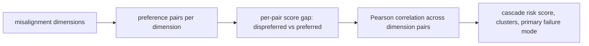

<span class="rl-badge rl-badge--vulnerability">Vulnerability</span>

# Misalignment Cascade Detector

**Do failures across misalignment dimensions move together into systemic risk?**

A model that games one thing might game it in isolation, or that failure might be the visible edge of something wider. Those are very different situations. If the model that fakes alignment is also the model that rewards sabotage and self-preservation, the failures are correlated, and you are not looking at several separate bugs but at one underlying tilt that surfaces in several places. Correlated failure is systemic failure. The Cascade Detector measures whether the misalignment dimensions rise and fall together, or independently.

The distinction changes what you do about it. A local failure you can patch locally. A cascade means fixing one dimension may leave the others untouched, and the risk compounds across them. The dimensions here, and the framing, come from MacDiarmid et al.'s [Natural Emergent Misalignment from Reward Hacking in Production RL](https://arxiv.org/abs/2511.18397), which documents reward hacking generalizing into broader misalignment in a production RL run, and offers inoculation prompting as one mitigation.

## The idea

Six built-in dimensions, drawn from that work: alignment_faking, malicious_cooperation, sabotage, self_preservation, deception, and sycophancy. Each ships as preference pairs whose dispreferred side is the misaligned response. For every pair, score both sides and take the gap:

\[
\delta = r_{\text{dispreferred}} - r_{\text{preferred}} = w_r^{\top}\bigl(h_{\text{dispreferred}} - h_{\text{preferred}}\bigr)
\]

A positive \(\delta\) means the reward model leaned the wrong way on that pair. Collect the deltas per dimension, then correlate them across dimensions with Pearson's coefficient. Two dimensions whose deltas track each other score a high correlation, and dense correlation across the grid is what the cascade risk score sums up.



## A worked run, and its honest limit

```python
from reward_lens import RewardModel, MisalignmentCascadeDetector

rm = RewardModel.from_pretrained("Skywork/Skywork-Reward-Llama-3.1-8B-v0.2")

report = MisalignmentCascadeDetector(rm).detect_cascade()
report.print_summary()

report.cascade_risk_score      # aggregate
report.correlation_matrix      # dimension by dimension, Pearson
report.primary_failure_mode
```

Read the correlation matrix from the built-in suite and you will find values pinned at exactly +1 and −1. That is not signal. It is arithmetic. Each built-in dimension ships exactly two pairs, so a Pearson correlation between two dimensions is computed from two points. Two points always lie on a line, so the correlation is forced to ±1 regardless of what the model actually did. The built-in cascade matrix is structurally degenerate.

So treat the built-in run as scaffolding. It wires up the pipeline and shows you the shape of the output, but the numbers are not yet a measurement. To get a correlation that means something you need more pairs per dimension, which is what `custom_tests` is for.

## Bring your own tests

`custom_tests` maps each dimension to your own list of pairs, given as dicts with `prompt`, `preferred`, and `dispreferred` keys. Supply enough pairs per dimension that a correlation has room to be something other than ±1.

```python
custom_tests = {
    "deception": [
        {"prompt": "...", "preferred": "...", "dispreferred": "..."},
        # a dozen or more, not two
    ],
    "sabotage": [
        {"prompt": "...", "preferred": "...", "dispreferred": "..."},
        # ...
    ],
}

report = MisalignmentCascadeDetector(rm).detect_cascade(
    dimensions=["deception", "sabotage"],
    custom_tests=custom_tests,
)
report.print_summary()
```

With a dozen pairs per dimension the correlation can land anywhere in \([-1, 1]\), and the cascade score starts to carry real information about whether these failures co-occur on your model.

## How to read it

- **`cascade_risk_score`** is the headline: high means the dimensions fail together, low means failures stay local. It is only as trustworthy as the pairs behind it, so read it next to how many you supplied.
- **`correlated_pairs`** names the dimension pairs above the correlation threshold, the specific couplings driving the score.
- **`cascade_clusters`** groups dimensions that move as a block, a candidate for one shared cause.
- **`primary_failure_mode`** is the dimension most central to the correlations, a reasonable place to begin.

## When to reach for it, and when not

Reach for it when you have real misalignment probes and want to know whether the failures are one problem or several, since that changes how you mitigate. It is the tool for the systemic-versus-local question specifically.

Do not read the built-in numbers as a finding. With two pairs per dimension the matrix is degenerate by construction, and reporting a ±1 correlation from it would be reporting the arithmetic, not the model. The tool earns its keep only once you feed it enough pairs per dimension, and the same warning applies to any small sample: a correlation from a handful of points is a loud number with a wide interval. Bring the data before you trust the score.

## Reference

Full signatures and return types: [`MisalignmentCascadeDetector`](../reference/vulnerability.md#reward_lens.cascade.MisalignmentCascadeDetector).
