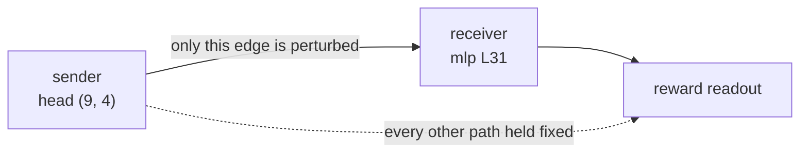

<span class="rl-badge rl-badge--causal">Causal</span>

# Path Patching

**Does one head reach the reward through one specific later component?**

Activation patching asks whether a component matters. Path patching asks whether it matters *through a particular route*. Those are different questions. A head can be causally necessary and still do all of its work by feeding some pathway you do not care about, and patching the head on its own will not tell you which one. Path patching pins down the wire: one sender head, one later receiver, and the single edge between them.

It is a two-hop intervention. You name a sender, a specific attention head, and a receiver, a later component, and the tool perturbs *only* the contribution flowing from the sender into the receiver while it holds every other path in the model fixed. Whatever changes in the margin traveled down that one route and no other.



The result is the same subtraction as activation patching, restricted to the route: `path_effect = original_differential - patched_differential`, where the patch touches nothing but the sender-to-receiver contribution.

Two constraints fall out of the mechanics, and the tool enforces both. The sender has to be head-level, a `("head", L, H)` triple, because the method splices one head's output into the receiver's input. The receiver has to sit *later* than the sender, since the contribution only flows forward. The sender being head-level is not a limit you feel elsewhere here: head-level path patching works even though head-level attribution does not. The idea is due to Goldowsky-Dill et al. (2023).

## A worked run

The disagreement between attribution and patching on the sky-is-blue pair leaves an obvious question. Patching says the early layers do the causal work; attribution says the last MLP is where the reward shows up. Do the two connect? Path patching lets you ask it directly: does an early head reach the reward *through* that late MLP. You supply the hypothesis by naming the two ends.

```python
from reward_lens import RewardModel, PathPatcher

rm = RewardModel.from_pretrained("Skywork/Skywork-Reward-Llama-3.1-8B-v0.2")
pp = PathPatcher(rm)

# prompt / chosen / rejected as in the activation-patching run

result = pp.patch(
    prompt, chosen, rejected,
    sender=("head", 9, 4),        # head-level: required
    receiver=("mlp", 31, None),   # must sit at a later layer than the sender
    mode="noising",
)

result.original_differential   # +24.03, the full margin
result.path_effect             # how much of it travels this one route
result.patched_differential
```

The sender and receiver indices are yours to choose, and here they are a guess: head 4 in layer 9, feeding the MLP at layer 31. That is the whole point. Path patching does not go looking for a circuit; it checks the one you propose.

## How to read it

Compare `path_effect` against `original_differential`. If the effect is a large share of the +24.03 margin, most of the sender's influence on the reward really does pass through that receiver, and you have found a wire. If it is near zero while activation patching still flagged the sender as necessary, the sender matters some other way: it reaches the reward through a different component, and this particular route was the wrong guess. A null here is informative. It rules a route out.

Because you pick both ends, the tool confirms routes rather than discovering them. A real circuit search is many path patches over a hypothesis you built with the cheaper tools first: read the reward lens and attribution for candidates, patch components to find which are necessary, then path-patch to learn how the necessary ones are wired together.

## When to reach for it, and when not

Reach for path patching once you already have two suspects and a story about how they connect. It is the right tool for "head A feeds MLP B," the wrong tool for "which components matter," which is [activation patching](activation-patching.md), and wrong again for "where is the reward," which is the [reward lens](reward-lens.md).

It inherits activation patching's hazard. Splicing one head's contribution into a later component's input can push that input off the model's natural distribution, so a path effect can reflect a state the model never actually visits. Treat a surprising route the way you would treat a surprising patch effect, and check it with [divergence-aware patching](divergence-patching.md) before you build on it.

## Reference

Full signatures and the `PathPatchResult` fields: [`PathPatcher`](../reference/causal.md#reward_lens.path_patching.PathPatcher).
