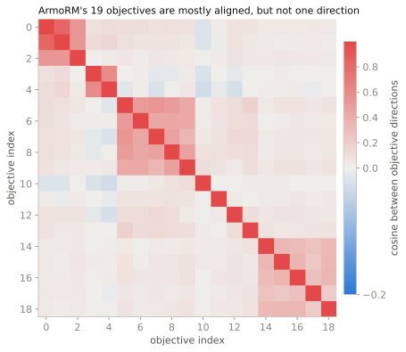

<span class="rl-badge rl-badge--vulnerability">Vulnerability</span>

# Reward-Term Conflict

**Are two reward terms aligned, orthogonal, or pulling against each other?**

Composite rewards are built from parts: a term for helpfulness, one for safety, one for brevity, and so on, summed into a single score. The parts do not always agree. When two terms point the same way, optimizing the sum improves both. When they point opposite ways, optimizing the sum means trading one off against the other, and the model's cheapest move is often to satisfy the winning term by suppressing the behavior the losing term would have penalized. That is the monitorability cost of conflict: the losing behavior does not go away, it goes quiet. This tool measures the geometry between term directions and tells you which pairs are aligned, which are independent, and which are fighting.

The three relationships are the ones Kaufmann, Lindner, Zimmermann, and Shah analyze in [Aligned, Orthogonal or In-conflict: When can we safely optimize Chain-of-Thought?](https://arxiv.org/abs/2603.30036), which asks when optimizing under such terms stays safe and when it drives the model to obscure its own reasoning.

## The geometry

Each reward term gets a direction in the model's activation space, learned as the average of \(h_{\text{preferred}} - h_{\text{dispreferred}}\) at the final layer over a handful of pairs that isolate that term. That is the direction along which the term increases. Normalize the directions to unit length and take cosines:

\[
\cos(d_i, d_j) = \frac{d_i^{\top} d_j}{\lVert d_i \rVert \, \lVert d_j \rVert}
\]

The cosine sorts each pair into one of three relationships, the same three the paper names:

| Relationship | Condition |
| --- | --- |
| Aligned | \(\cos > 0.5\) |
| Orthogonal | \(\lvert \cos \rvert < 0.2\) |
| In conflict | \(\cos < -0.3\) |

Aligned terms reinforce each other. Orthogonal terms are roughly independent, so optimizing one barely moves the other. In-conflict terms trade off, and that is the case to watch.

## A worked run

To check your own terms, hand `quick_conflict_check` a few contrastive pairs per term, each a `(prompt, preferred, dispreferred)` triple where the preferred side is better on that one term.

```python
from reward_lens import RewardModel, quick_conflict_check

rm = RewardModel.from_pretrained("Skywork/Skywork-Reward-Llama-3.1-8B-v0.2")

term_pairs = {
    "conciseness": [
        ("Summarize the update.",
         "Shipped the parser; two bugs left.",
         "There is quite a lot to say here, and to start at the very beginning..."),
    ],
    "warmth": [
        ("My build keeps failing.",
         "That sounds frustrating. Let's track down what's breaking, step by step.",
         "The failure is a missing dependency."),
    ],
}

report = quick_conflict_check(rm, term_pairs)
report.print_summary()

report.in_conflict_pairs        # term pairs with cosine < -0.3
report.overall_conflict_score
report.monitorability_risk
```

`quick_conflict_check` learns the directions and analyzes them in one call. If you want the directions in hand, run the two steps yourself: `RewardConflictAnalyzer(rm).learn_term_directions(term_pairs)`, then `.analyze_conflicts(directions)`.

## When one score is secretly many

The most instructive subject is a model whose single reward really is a sum of terms. ArmoRM has nineteen objective heads and a gate that reweights them per input. `reward-lens` hands its standard tools one direction for ArmoRM, and that direction is the average of the nineteen objective heads, so to study the objectives themselves you read them straight off the regression layer and run the same geometry over them.

```python
from reward_lens import RewardModel, RewardConflictAnalyzer

armo = RewardModel.from_pretrained("RLHFlow/ArmoRM-Llama3-8B-v0.1")

objectives = armo.adapter.per_objective_directions(armo.model)   # (19, d_model)
terms = {f"obj{i}": objectives[i] for i in range(objectives.shape[0])}

report = RewardConflictAnalyzer(armo).analyze_conflicts(terms)
report.print_summary()
report.similarity_matrix        # the 19-by-19 cosines below
```

{ .rl-fig }

/// caption
The 19-by-19 cosine matrix of ArmoRM's objective directions. The diagonal is 1 by definition. Off the diagonal, most pairs are weakly to moderately aligned rather than identical: obj0 and obj1 sit at 0.82, while obj0 and obj10 sit at −0.02, essentially orthogonal. Warm cells lean the same way, pale cells are near-independent.
///

Read the matrix as a spread, not a point. The objectives mostly lean the same way, but not by much, and some are effectively unrelated. This is the honest footnote under every ArmoRM result elsewhere in the site: the single direction the library uses for ArmoRM is a gated average of these nineteen, and since they do not all point the same way, that average genuinely represents no single one of them. The "one direction" picture is an approximation for ArmoRM, and this matrix is what it approximates. There is also an `analyze_multi_objective_model()` convenience, but it inspects that already-averaged direction, so reaching the nineteen means going to the objective heads as above.

## How to read it

- **`relationship_matrix`** labels every pair aligned, orthogonal, or in-conflict; `similarity_matrix` holds the raw cosines behind those labels.
- **`in_conflict_pairs`** is the list to act on: terms pulling against each other, where optimization has to sacrifice one.
- **`overall_conflict_score`** summarizes how much conflict is present across all pairs.
- **`monitorability_risk`** is the reason to care: more conflict raises the chance that optimizing the total hides a losing behavior rather than fixing it.

## When to reach for it, and when not

Reach for it when your reward is a composite and you want to know whether its parts cooperate, and when you are deciding whether it is safe to optimize hard against the sum. A pair in conflict is a standing invitation for the model to game one term at the other's expense.

The picture is only as good as the directions behind it. Each term direction is averaged from a few pairs, so a noisy or too-small pair set gives a noisy direction and a cosine you should not over-read; use enough pairs per term that the direction is stable. And for a multi-objective model the whole analysis inherits the same approximation the ArmoRM matrix makes plain: you are studying learned summaries of the objectives, not the objectives in full. The geometry is a strong hint about where terms conflict, to be confirmed, like every hint in this library, before it is trusted.

## Reference

Full signatures and return types: [`RewardConflictAnalyzer`](../reference/vulnerability.md#reward_lens.conflict.RewardConflictAnalyzer).
