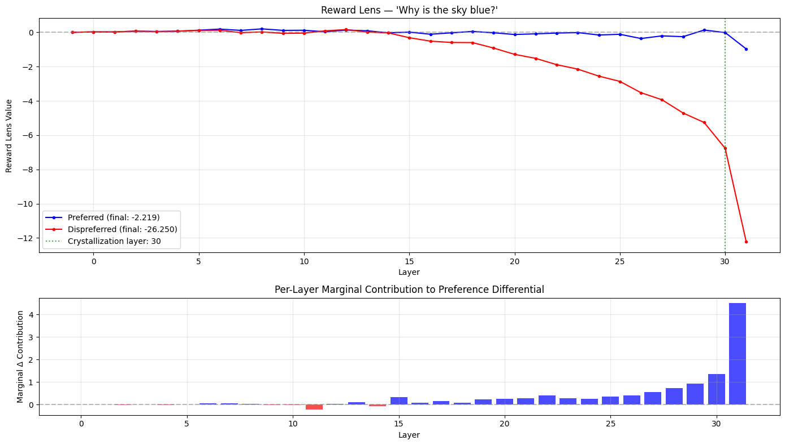

<span class="rl-badge rl-badge--observational">Observational</span>

# Reward Lens

**Which layers have already decided the winner?**

The reward model produces its score at the end, but the decision is built up along the way. The reward lens lets you watch it happen. Take the residual stream at every layer, project it onto the reward direction, and you get the reward the model *would* assign if it stopped there. Do that for both members of a preference pair and track the gap, and you can see, layer by layer, the preference form.

It is the reward-model analog of the logit lens, with the one change that reorganizes everything: there is no vocabulary to decode into, no distribution to summarize. There is one direction, \(w_r\), and one number that says how far this layer's state leans toward what the reward model wants.

## The idea

The residual stream is a running sum: each layer adds its output, and the final state is the total. Because the reward is linear in that final state, it is also linear in the running sum, so you can evaluate the readout at any intermediate layer \(\ell\):

\[
r^{(\ell)} = w_r^{\top} h^{(\ell)} + b
\]

That is the reward lens value at layer \(\ell\). For a pair, the quantity that matters is the margin at each layer, \(\Delta^{(\ell)} = w_r^{\top}\bigl(h^{(\ell)}_{\text{chosen}} - h^{(\ell)}_{\text{rejected}}\bigr)\), which starts near zero and grows to the final margin. The layer where it first reaches half the final value is the [crystallization depth](../concepts/crystallization.md).

## A worked run

One call traces the canonical sky-is-blue pair and returns everything.

```python
from reward_lens import RewardModel
from reward_lens.lens import RewardLens

rm = RewardModel.from_pretrained("Skywork/Skywork-Reward-Llama-3.1-8B-v0.2")
lens = RewardLens(rm)

prompt = "A student asks: 'Why is the sky blue?' Please give a clear, accurate explanation."
chosen = ("Sunlight is a mix of all visible wavelengths. When it enters Earth's atmosphere, "
          "molecules scatter the shorter (blue) wavelengths much more strongly than the longer "
          "(red) ones — this is Rayleigh scattering. Blue light bounces around the sky in every "
          "direction, so when you look up, blue is what reaches your eyes from almost everywhere.")
rejected = ("The sky is blue because blue is the color of the sky. It has always been blue and "
            "always will be. Nobody really knows why, it's just one of those things.")

result = lens.trace(prompt, chosen, rejected)

result.crystallization_layer     # 30  (of 32)
result.reward_preferred          # -2.22   (final scalar)
result.reward_dispreferred       # -26.25
result.differential[-1]          # +24.03  (final margin)
result.plot()
```

The result object carries the per-layer arrays too: `result.differential` (the margin at each layer), `result.marginal_contributions` (the per-layer *change* in margin, one shorter than `layers`), and `result.layers` (the layer indices, starting at `-1` for the post-embedding state). If you just want the picture, `reward_lens_plot(rm, prompt, chosen, rejected)` runs the trace and plots in one line and hands back the same result.

{ .rl-fig }

/// caption
The two responses' projections onto \(w_r\), layer by layer, with the per-layer contribution to the margin below. Both stay near zero and tangled for the first two-thirds of the network. Then the rejected answer falls away sharply and the margin opens, most of it written by the last few MLPs. Crystallization lands at layer 30.
///

## How to read it

- **A flat, tangled early section** means the model has not committed yet. The representations are still being built; the reward is not yet legible in them. On Skywork this runs for roughly the first thirty layers.
- **The split** is the model making up its mind. Where the curves separate for good is where the preference becomes real. A late split (Skywork) means the judgment waits for nearly complete representations; an earlier, noisier split (ArmoRM) means a different schedule.
- **The bottom bars** show which layers wrote the margin. Tall late bars are the signature of late crystallization.

## When to reach for it, and when not

Use the reward lens first, always. It is one or two forward passes for the whole model, and it gives you the map: where the preference forms, so you know where to point the more expensive tools. It is the right first look at any new model or any surprising pair.

Do not read it as causal. This is the trap the reward lens sets, because the picture is so clean. "The margin forms at layer 30" is a statement about where the reward *becomes visible*, not about what *causes* it. On this very pair, [patching](activation-patching.md) finds the early layers carry more causal weight than the late ones that dominate the lens. If your claim is about cause, the lens is the hypothesis, not the evidence. See [observational vs causal](../concepts/observational-vs-causal.md) for why, and the [honesty section](../caveats.md) for the full accounting.

## Reference

Full signatures and return types: [`RewardLens`](../reference/core.md#reward_lens.lens.RewardLens).
